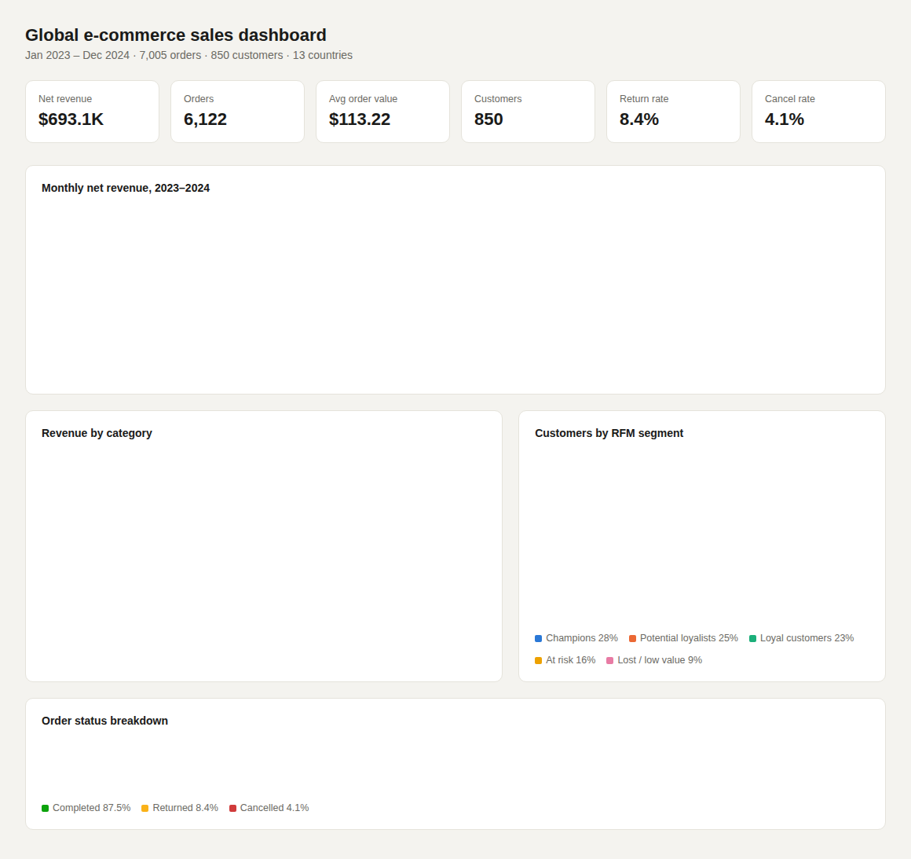

# Global E-Commerce Sales Analysis (2023–2024)

A portfolio data analysis project exploring revenue trends, product/regional performance, return patterns, and customer segmentation for a simulated global online retailer.

## Dashboard



The dashboard summarizes the notebook's findings at a glance: revenue, orders, AOV, customer count, return rate, and cancel rate up top; a monthly revenue trend showing clear holiday seasonality; revenue by category; customers by RFM segment; and an order-status breakdown. Open `dashboard_static.html` in a browser for the live (interactive-on-hover) version.

## Files
- **`ecommerce_analysis.ipynb`** — main analysis notebook (data cleaning → EDA → RFM customer segmentation → business recommendations)
- **`dashboard_static.html`** — standalone HTML/Chart.js dashboard (the source for the screenshot above — open directly in any browser)
- **`dashboard_preview.png`** — screenshot of the dashboard, embedded above
- **`ecommerce_sales_raw.csv`** — raw dataset (7,105 orders, intentionally includes missing values, duplicates, inconsistent formatting, and outliers to mirror real-world data)
- **`ecommerce_sales_clean.csv`** — cleaned dataset produced by the notebook
- **`generate_data.py`** — script used to synthesize the raw dataset (documents exactly what "messiness" was injected and why)

## What this project demonstrates
- **Data cleaning:** handling missing values, duplicate rows, inconsistent text formatting, invalid values, and outliers — with an auditable, step-by-step log
- **Exploratory data analysis:** time-series trends, seasonality, category/regional breakdowns
- **Customer analytics:** RFM (Recency, Frequency, Monetary) segmentation to identify high-value and at-risk customers
- **Business storytelling:** every chart is paired with a plain-English insight and a concrete recommendation, not just a plot

## Tech stack
Python · pandas · NumPy · matplotlib · seaborn · Jupyter

## How to run
```bash
pip install pandas numpy matplotlib seaborn jupyter
jupyter notebook ecommerce_analysis.ipynb
```

## Notes for using this in your portfolio
- The dataset is synthetic (generated by `generate_data.py`), so the numbers are illustrative, not real business data — that's actually a feature for a portfolio piece: it's reproducible and you can regenerate it with different seeds/patterns.
- To make this truly yours: swap in a real public dataset (e.g., a Kaggle e-commerce/retail dataset) and re-run the same notebook structure — the cleaning and analysis logic will mostly transfer directly.
- Consider adding this notebook + a screenshot of the seasonality chart to your GitHub README and resume as a linked project.
